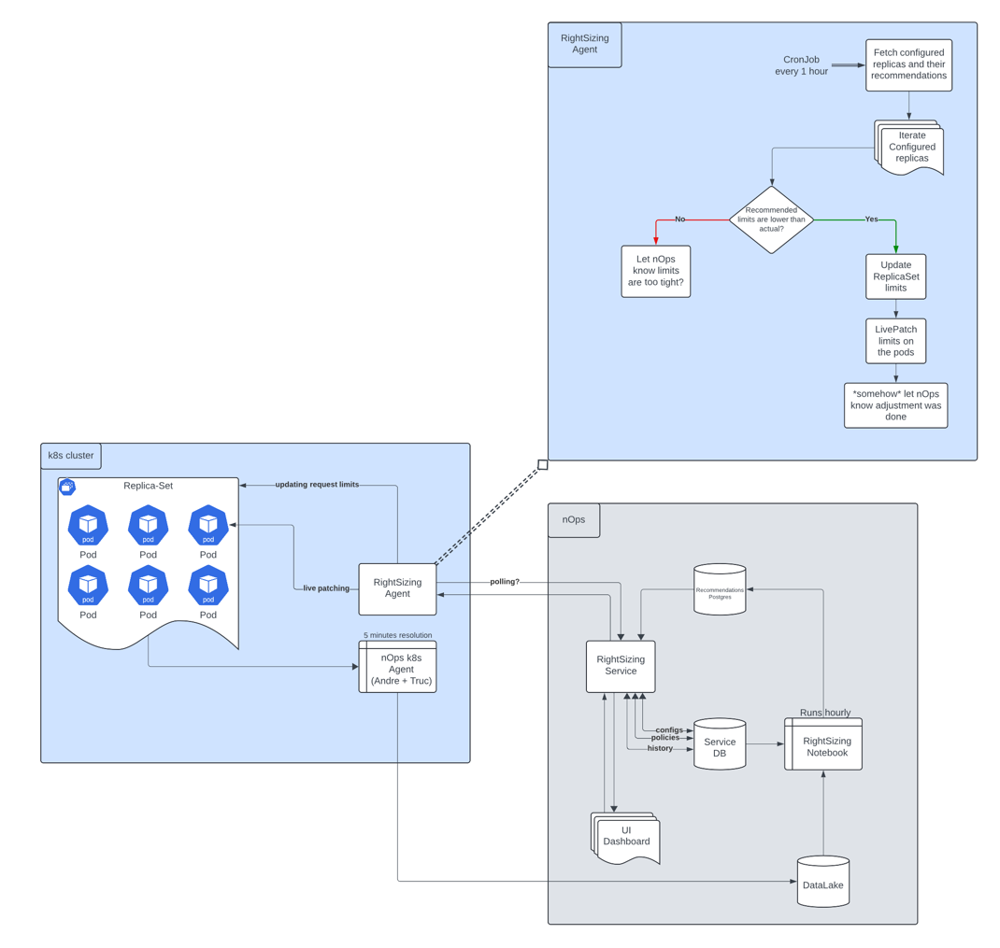

# Pod Rightsizing

### High-level Logic:

- Fetch configured Deployments / Workloads from nOps side
- List cluster Deployments / Workloads
- For each Namespace that contains configured Deployments / Workloads:
  - Fetch namespace recommendations (pod -> container requests)
  - [Analyze namespace Limit Ranges](limit_ranges.md) and if Recommended values satisfy these ranges:
    - If [Pods Live-Patching](pod_patching.md) enabled - patch Pods in-place
    - Patch parent resource ([Deployment](deployment_patching.md), Replica Set) to the recommended requests